
CSI 3140 - WWW Structures

Winter 2022

Professor - Dr. Andrew Forward

Deliverable 3

Project Report

March 4th, 2022

- Parth Sharma 300057574

- Kishan Mrug 300069420

# About

For this deliverable, we followed the rubric and integrated database and also server technology (implemented during the labs). Changes in styling of website are done to make the website look better using bootstrap, php and JavaScript.
A screenshot of all updated webpages are posted which highlight the features.

**Table of Contents**
1. Integration of server technology using PHP
2. Database Technology integration
3. Automated test framework in place
4. Deployment / Upgrade Scripts working
5. Refined HTML/CSS + UI Design System
6. Front-end (mock) interactivity using JavaScript

1.
**Integration of server technology using PHP**
We used the application XAMPP to integrate using apache web server technology using php.
Our code was already converted to .php while working on the labs. 

link to xampp - https://www.apachefriends.org/download.html

The website can be accessed using the trajectory - xampp/htdocs/folder/....

Once Xampp is downloaded and the Xampp control panel is opened we will run the apache server on our localhost. For now we will be running our project on the localhost only instead of any other web server.

## 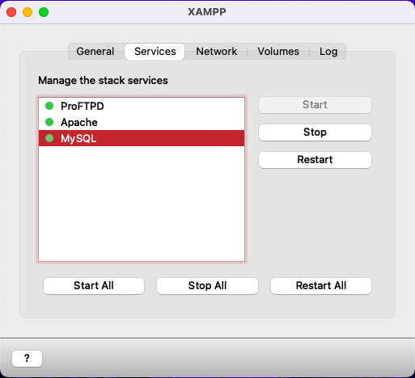 

2.
**Database Technology integration**
For the deliverable, we originally used PHPMYADMIN , MYSQL (for lab06) to maintain our draft database but since we were more used to POSTGRES we eventually switched to it and used to PGADMIN4 as our database management software .

In Postgres, we created a table 'login_info' which includes parameters  -
    user_id
    username
    password

and contains a population of 4 entries currently entered both manually and using web page. The user_id is automatically generated and the username and password are stored in the database.    

## 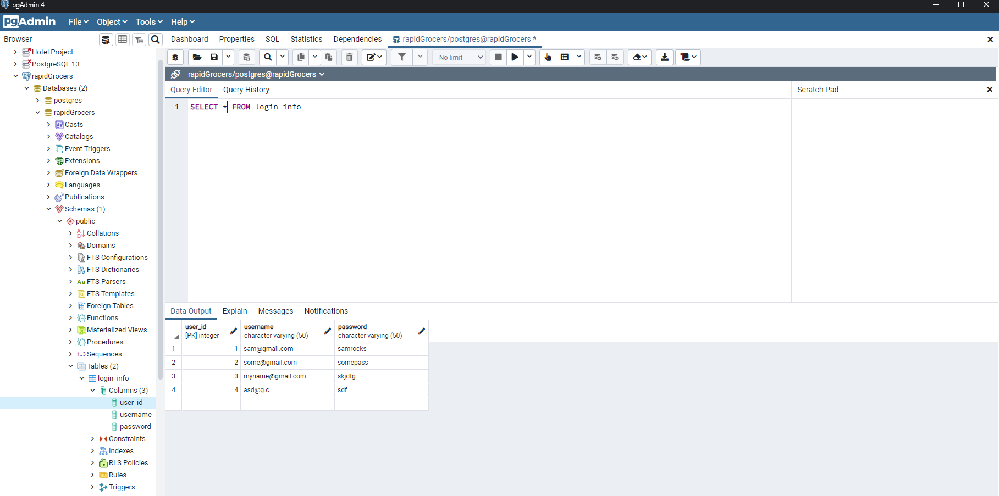 

We verify the username and password, if the user inputs a wrong usernmae or password we generate a blank page which shows an error as follows-

## 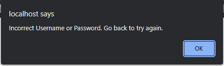 

But, if it is valid we go to homepage with grocery.
We again used XAMPP to enable pgsql on the apache server .

3.
**Automated test framework in place**
We used the PHPUNIT testing framework to test the automatic testing. The testing framework can be set up using the following promt on cmd/terminal -

composer require --dev phpunit/phpunit ^9 to get the latest version.

Requirement : "composer" should already be installed in the system to test the framework, for those simple steps can be followed from -

https://getcomposer.org/download/

4.
**Deployment / Upgrade Scripts working**

Shows how to deploy the project from using the local host and shows how everything is added.

## 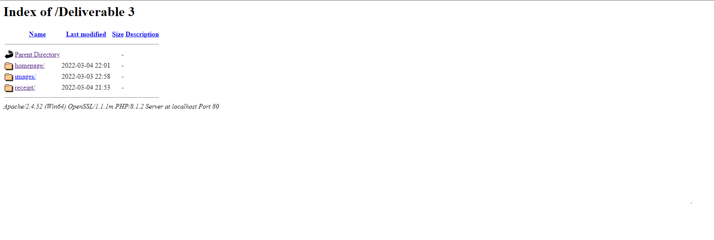 

5. 
**Refinement of UI System designment and the existing html and css files -**

Our UI design saw some changes from our submitted deliverable 2. The pages were made more user friendly and functionality like bootstrap and Google API were used to style and modernize it. The summary details of the newer changes are as follows - 

## Info
For the updates in info.php we made a more user friendly format by implementing bootstrap.
Also using API from google , the address the user types automatically gives the option to fill up .

## 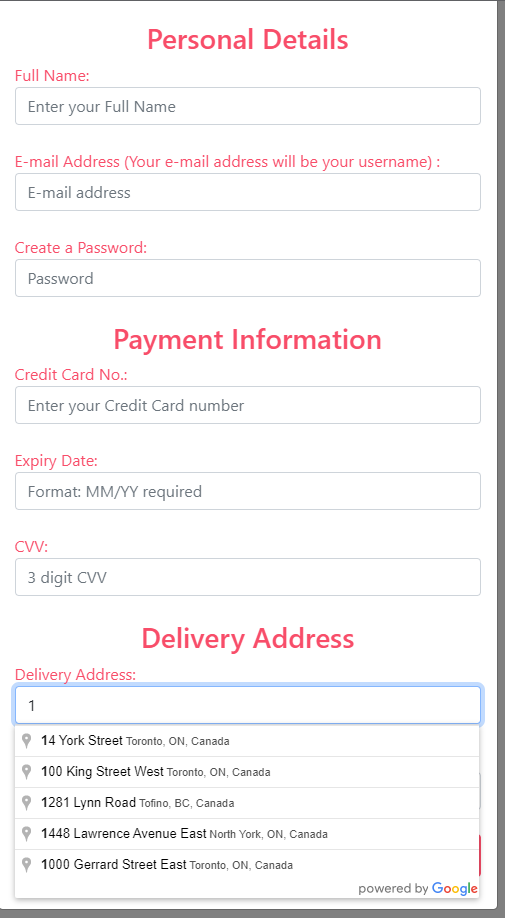 

## 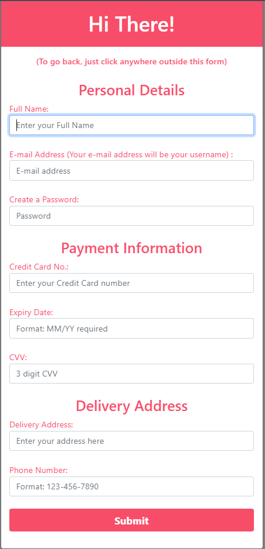 

*Fig 1 : Updated Screenshot of Info Page*

## Login
A small change was made in the login page where the 'veggie.png' is now used as a side by side panel instead of background picture.
The sign in function is functional and works where if your information is already stored in the database , you can go to the homepage to continue shopping.
Else they can create their new profile and register

## 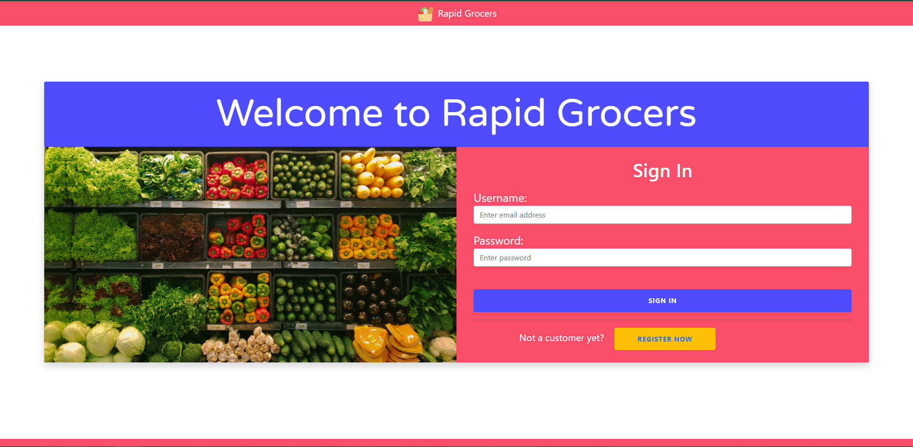 

*Fig 2 : Screenshot of Login Page*

## Homepage
Instead of a separate panel on the left side of the webpage we used a drop-down menu in the navigation bar to change the categories

## 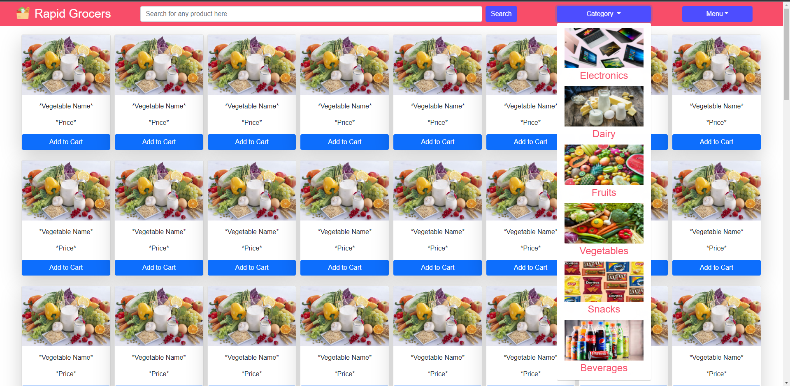 

## 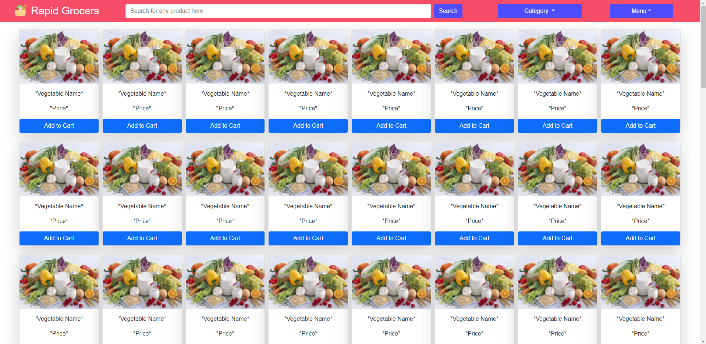 

*Fig 3 : Screenshot of Home Page*

## Receipt

Bootstrap was implemented on the table to make it look more user friendly. The overall UI is now more spacious and since bootstrap is used, minimizing the window doesn't interfere with the quality of the website.

## 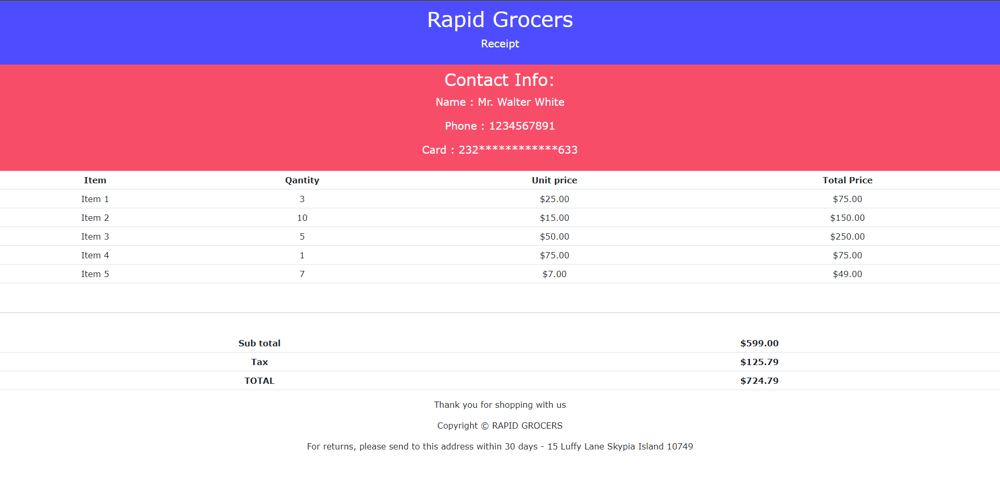 

6. 
**Front-end (mock) interactivity using JavaScript**

 We have successfully configured the sign up and sign in page with a fully functional database system.
 Upon clicking on the "add to cart" button the user will be able to add or delete quantities of the item.

 ## 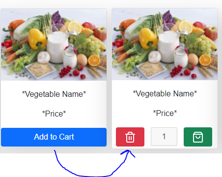 

###		
###

