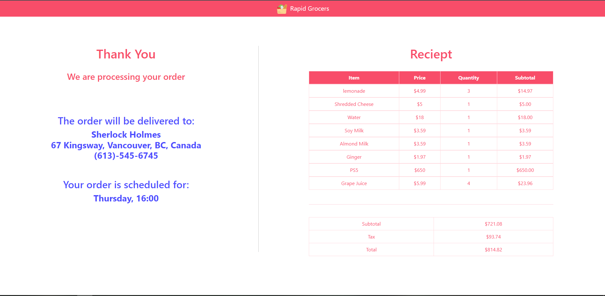
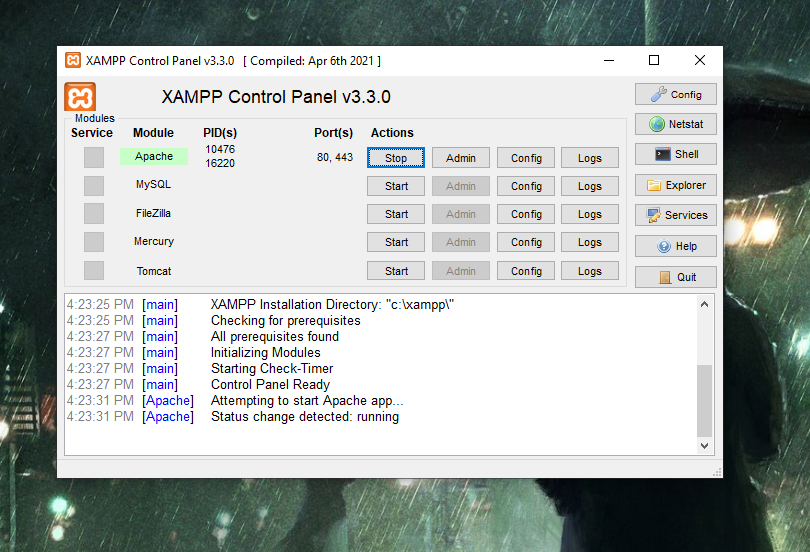

 CSI 3140 - WWW Structures

Winter 2022

Professor - Dr. Andrew Forward

Deliverable 4

Project Report

April 4th, 2022

Parth Sharma 300057574

Kishan Mrug 300069420

# About
This is the final deliverable of the project.
We implemented a fully functional website named "Rapid Grocers" which lets a user buy products from a variety of categories such as:

1. Electronics
2. Dairy
3. Vegetables
4. Snacks
5. Fruits
6. Beverage

Rapid Grocers is detailed to be user friendly, and follows a systematic color scheme.

The color scheme used throughout our deliverable is:
rgb(248, 77, 105) ss
rgb(77, 77, 255) ss

<!-- END -->

Below is a detailed description of the various things we implemented in the project.

# Table of Contents

1. Implementation of features Server/Client/HTML/CSS
2. Software documentation (installing,testing and developing)
3. Adherence to UI design system
4. Seeding application with sample data
5. Application v1.0 (quality versus quantity)
6. Git usage (commit messages, all students involved)
7. Screenshots and pictures taken

<h2> 1. Implementation of features Server/Client/HTML/CSS </h2>
<h3>Technologies Used:</h3>

1. XAMPP
2. postgreSQL (pgAdmin4)

<h3>Languages Used:</h3>

1. HTML
2. CSS (incl. Bootstrap)
3. JavaScript
4. PHP
   
<b>Login Page</b>

This is the starting page of the website. The user will be greeted with the following page:
##  

<h5>Returning User</h5>

If it is a returning user, then they can enter their username (which will be their email address) and password, and click on "Sign In", if the user exists in the database, then the user will be let in, or else an "Incorrect Username or Password" pop up will be presented and then they will be redirected to the login page.

1. Invalid User/User entered incorrect information
   
   They will click on "Sign In"
   ##  
   An error message will be presented
   ##  
   They will be redirected to the login page again
   ##  

2. Valid User

    They will click on "Sign In"
    ##  
    They will be redirected to the Homepage (This will be displayed in the "Homepage" section of the README)

<h5>New User</h5>

If it is a new user, then they will click on the "Register Now" button
##  
Doing so will open up the following Modal
##  

<h6>Personal Details</h6>
Here the user can fill out details such as: Full Name, E-mail address, and Password

## 

<h6>Delivery Details</h6>
Here the user can fill out details such as: Delivery Address, and Phone Number.
When they start to fill out their delivery address, Google API will kick in as shown below

##  

Then they can either select the options presented, or search further to filter out the address
##  
Next, they will have to enter their Phone Number, and only numbers will be accepted, and it has to be a 10 digit number, or the form will not submit
##  
##  

Then, they will click on Submit, and they will be redirected to the Homepage (This will be displayed in the "Homepage" section of the README)

<b>Homepage</b>

<h6>Welcome Message</h6>

After the user has been redirected from the Login page to the homepage, the user will be greeted with the following message
##  

Over here, the users can browse for products and them to the cart
##  

If the user hovers over a product, they will slightly enlarge
##  

<h6>Shopping</h6>

By clicking on "Add to Cart", the product will get added once to the cart
##  

The user can now increase the quantity of the item by clicking on the Green Shopping Bag button, and the quantity will increase in the text box
##  

The user can now decrease the quantity of the item by clicking on the Red Trash button, and the quantity will decrease in the text box
##     

If they want to remove the item from the cart, they can click on the Trash button until the quantity has reached 1, clicking it once more after that will revert the state of the card from 
##  
to 
##  

At first the user can see all the available products, but if a user wants to search for a particular category of products, they can hover on the category drop down menu which will open up the following six categories
##  

<h6>Category</h6>

They can click on any category, and the prodcuts will be sorted accordingly:

1. Electronics
   ##  
2. Dairy
   ##  
3. Vegetables
   ##  
4. Snacks
   ##  
5. Fruits
    ##  
6. Beverage
    ##  

<h6>Search Bar</h6>

They can also search for the product directly on the search bar and clicking the "Search" button
##  
##  

The user can also hover on the "Menu" button if they would like to "Log Out" or "Contact Us"
##  

If the user clicks on "Log Out", they will be redirected to the Login page.
##  

If the user clicks on "Contact Us", they will be redirected to the Contact Us page (This will be displayed in the "Contact Us" section of the README).

<h6>Cart</h6>

If the user has not added anything to the cart yet but clicks on the Cart button, then the Checkout button (NOTE: will be explained in the "Checkout" sections of the README) will be disabled and the cart subtotal will be $0
##  
Now let us say the user has done some shopping and added a few items to the cart
##  
They can then click on the Cart button to open their cart, and see the items they added, the price, the quantity, and the current subtotal
The Checkout will button will now be enabled
##  
Now let us say that the user wants to edit their cart and remove some items, and categorize the products and add, and search for a few items and add products to their cart
##  
Adding items after categorizing them
##  
Adding items after searching for the item
##  
Now the user has finished shopping and will click the Checkout button and will be redirected to the Checkout page.

<b>Checkout</b>

NOTE: If there are too many products in the cart, the list will become scrollable, and the user will be able to scroll to see other products

In this page, they will be presented with their shopping cart with the subtotal for each product and the subtotal for the entire cart
##  
Next they will need to enter their Credit Card details without which they will not be able to successfully place their order
The credit card field will accept only integers, and it has to be 16 digits, the minimum expiry for the card has to be this year, and a 3 digit cvv is also required
##  
Next, the user can opt to save their payment information if they want the credit card field to autofill the next time they login.
They can then click "Place Order" to place their order, and they will be redirected to the "Receipt" page (This will be displayed in the "Receipt" section of the README).
##  

<b>Receipt</b>

NOTE: If there are too many products in the cart, the list will become scrollable, and the user will be able to scroll to see other products

In this page the user will see a confirmation saying the order was placed
##  
In the above picture, you can see that the delivery address, and the phone number that they provided earlier is displayed
They will also be able to see their receipt with the tax added to it and the items they purchased
##  
After this, they will automatically be logged out

<b>Contact Us</b>

In this page, the user will be able to send us a message about any issue and it will get saved in the database.
##  
They will be asked to provide their Name, E-mail address, and Comments, but they will not linked in the database with their Unique IDs to keep the feedbacks anonymous
There is also a limit of 1000 characters that can be entered, the remaining characters will update as the user types in the comment box
##  

<h2>2. Software documentation (installing, testing and developing)</h2>
    
The application was developed in HTML language primarily and in addition to that we used concepts from CSS, JS, PHP and Bootstrap to make our website look good, more user friendly and functional.
    
The backend of our website includes various files divided into sections to make it easier for us to merge them as well as to fix minor bugs so that the entire website does not go down in case something needs to be changed. 

## 
      
 Database is also a key part of our backend as it stores all user information and uses it when either a new user is logging in or an existing customer wants to retrieve his/her profile account, it is achieved through PgAdmin4 database using the SQL language

## 
## 
##  

 The front end of our website went through minor changes in color and design from deliverable 1 to deliverable 4, where we implemnted our first functional page back in deliverable 3. Now the website is fully functional like any other website, and has all the required features.

For testing, we had to use the server Apache using XAMPP and then through a local host server we were able to inlude and view php and database changes.

## 

For installation and setup, we had to download XAMPP, pgAdmin.

XAMPP - It a localhost server which helps in integrating PHP with the database 
To install - https://www.apachefriends.org/download.html and choose the version according to the operating system of your choice.

pgAdmin4 - the databse where our user information is stored. everything added was using SQL queries.
To install - https://www.pgadmin.org/download/ and choose the version according to the operating system of your choice.

<h3>3. Adherence to UI design system</h3>

The application is very user friendly and we have implemented a bunch of UI design systems to make the use of website easier for any customer to operate. 

All the UI elements were explained in detail with pictures in the "Implementation of features Server/Client/HTML/CSS" section

<h3>4. Seeding application with sample data</h3>

We had already implemented and connected our database with our website in the previous deliverable and labs.
As seen in the screenshots down below, we have some input data values present already in our database.

## 
## 
##  

We implemented the application website as a proper functioning website where if a user registers through the application, the database gets populated simulateously with that new value, so we are not dependant on hard coding user values in backend, and in essence, any user from anywhere can use our front end website to register as a customer at our website

<h3>5. Application v1.0 (quality versus quantity)</h3>

The application works like any normal online grocery shopping website. The user upon reaching the website finds himself in the login page, where they can either create new account or log in to existing account (if it is saved in the database). 
If the user is new, then they can register on the login page, where they will have to enter their credentials which would be stored in the database. After that, the user is sent to the homepage where they can browse freely the numerous items we have on display. If the user wants to search for a specific item, then they can write that down in the search bar and click on the Search button and it will show all the products which has that string in its name.
All items are shown as cards, and upon clicking the card, a Green Shopping Bag sign and a Red Trash sign appears by which the user can increase or decrease the quantity of the item. While shopping, the user can view their cart and the subtotal by clicking on the cart button.
Once done, the user can click on the checkout button which is available in the Cart itself.
The user is now sent to the Checkout page where they can view their cart and enter payment details. Upon clicking Place Order, the user goes to the Reciept page which shows the invoice of the purchase, the address it is delivered and time it will arrive at.
The website also has a Feedback page where a user can find our contact information and also send a constructive feedback or any issues they face (1000 character max). Throughout the shopping experience, the user also has the option to log out. 

<h3>6. Git usage (commit messages, all students involved)</h3>
The project was completed with collaboration of Parth Sharma (300057574) and Kishan Mrug (300069420). Both of us brainstromed ideas to implement, divide, and complete the assigned work on our own devices and finally merge & commit them on github to view progress of the entire project via the deliverables.

This project has been very informative for us where we understood and experienced the value of collaborating in a team and expressing creativity which would be helping us in the future.

<h3>7. Screenshots and pictures taken</h3>
The folder 'ImagesD4_ss' contains all the screenshots of the website we took and the folder 'products' and 'images' contains all the pictures we used for our products and it also contains all the screenshots we took for each page which are shown all throughout this documentation.

###		
###